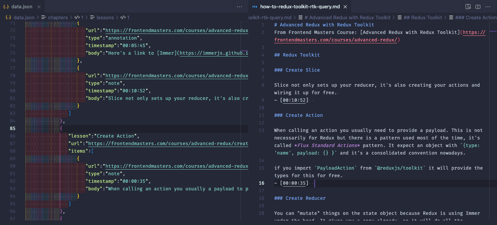

# Frontend Masters / Josh Comeau notes markdown converter

This script generates a markdown file from the notes you wrote on Frontend Masters course. It needs the exported json with your notes. 



## How to use: 
1. Clone this repository
2. Download the json file with your notes from the course platform.
3. Add the json file inside `sources` directory, rename it: `data.json`.
4. Launch the script with `npm start`
5. The file will be generated inside `dist` directory

## Notes:

* This is an early implementation just for my convenience (an alpha at least), feedback is appreciated. 

* You can generate a version without timestamp links by passing `false` as a second argument to the function `generateMarkdown`

## Bonus - Josh Comeau course notes:

1. Install dependencies `npm install`
2. Download the json file from Josh Comeau's course platform.
3. Add the json file inside `sources` directory, it should be called: `notes.json`.
4. Launch the script with:
```bash
npm run josh-course-parser [-- css]
```
5. The file will be generated inside `dist` directory

By default it will parse notes from The Joy Of React, in case you need notes for CSS in React course add `-- css` option to the command.
